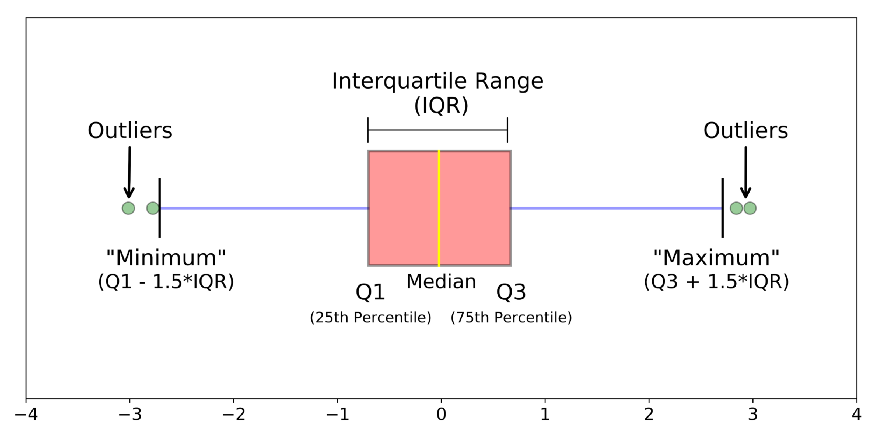

Data Wrangling with R
======================================
author: Jeho Park
date: March 7, 2022
autosize: true

QCL Workshop Participation Requirements: 
========================================================
Those of you attending this workshop as part of requirements for your research group, student employment, or fellowship position, you must attend the workshop fully, do all the hands-on exercises plus homework to be qualified. 

If you have to leave in the middle of the workshop, please leave a note on the chat for the record.

Recommendations for Engagement:  
(1) Use your camera to show your attention  
(2) Use gestures such as nodding, thumbs-up, and raising hand to signal your understanding/misunderstanding  
(3) Unmute yourself to ask questions *anytime* 

Workshop Environment Setup
====================================
### 1. Log in to RStudio Cloud
### 2. Create a new project -->  Clone the workshop files from my GitHub Repo (i.e., "New Project from Git Repo")
### 3. Open data-wrangling.Rpres
### 4. Open QCL-R-Workshop-L2-Hands-On.Rmd

    
*GitHub repo: https://github.com/CMC-QCL/R-Data-Wrangling-L2-Workshop.git

Agenda: Data Wrangling with R
====================================
- What is data wrangling?
- Built-in datasets
- Simple data examination and exploration
- Simple data visualization
- Data manipulation using dplyr package
- Data import (later in hands-on)
- Hands-On: 
  - Find information from a "birth2015" dataset; 
  - Create a barplot showing COVID-19 daily new cases in the U.S.

What is Data Wrangling?
======================================

  
Source: YouTube (https://youtu.be/vkBtEe-lieU?t=131) | Wrangling Wild Horses in the Mountains of Montana (Director: Kristopher Rey-Talley) | Short Film Showcase | National Geographic Channel on YouTube | clip from 2:11 to 3:11

What is Data Wrangling?
=============================================
Data wrangling is the process of obtaining, cleaning, reshaping and transforming raw (and messy) data into a usable form of processed (and tidy) data.

  
Source: "Data Wrangling with R" by Bradley C. Boehmke | Use R! Series

CO2 Dataset from "datasets" Package
====================================
- The CO2 data frame has 84 rows and 5 columns of data from an experiment on the cold tolerance of the grass species Echinochloa crus-galli.

```r
help(CO2) # see what the dataset is about
CO2 # display all the contents of the data frame, CO2
View(CO2)
```

- The `datasets` package contains several useful toy datasets. 
- Try `data()` from the console

A Quick Look of a Dataset (data.frame)
========================================================
Here are some simple and handy functions for everyday use.

```r
head(CO2) # show the first few observations
tail(CO2, 1) # show the last observation
summary(CO2) # this is a very handy function!
str(CO2) # show the structure of the data.frame
names(CO2) # show the variable names
```

Data Visualization
========================================
- Basic plots such as histogram, box plot, and scatter plot are within a few key strokes away (type `his` in the console and wait for a sec)


```r
hist(CO2$uptake) # Use help function to check its arguments
boxplot(CO2$uptake ~ CO2$conc)
plot(x = CO2$conc, y = CO2$uptake)
```
**Note that we used '$' to access (or extract) a variable (or a column) of a dataframe. 

Data Visualization - Boxplot
========================================================

```r
library(readr)
auto <- read_csv("auto.csv")
boxplot(auto$mpg ~ auto$cylinders, data = auto, xlab = "Number of Cylinders", ylab = "Miles Per Gallon", main = "Mileage Data")
```


Source: https://towardsdatascience.com/understanding-boxplots-5e2df7bcbd51


Data Manipulation using dplyr
===========================================
  
A grammar of data manipulation: https://dplyr.tidyverse.org/

Data Manipulation using dplyr
===========================================
- `dplyr` is the most popular package for data exploration and transformation
- `dplyr` includes 
   - `filter` 
   - `select` 
   - `arrange` 
   - `mutate`
   - `summarise` 
   - `group_by`
   

Data Manipulation using dplyr
===========================================
- `dplyr` is the most popular package for data exploration and transformation
- `dplyr` includes 
   - `filter` picks observations based on their values.
   - `select` picks variables based on their names.
   - `arrange` changes the ordering of the rows.
   - `mutate` adds new variables that are functions of existing variables.
   - `summarise` reduces multiple values down to a single summary.
   - `group_by` performs any operation by group.

## Check if you have the `dplyr` package installed and loaded. If not installed, install `tidyverse` package which includes `dplyr` and other useful packages such as `ggplot2`.

Data Manipulation using dplyr::filter
========================================
- `filter` with a logical operator on a value will filter in/out those observations (rows) with the value.


```r
# Logical Operators in R
5 == 2
5 < 2
(5 < 2) & (3 > 2)
5 %in% c(1,2,3,4,5)
is.na(c(1,2,NA,4,5))
```

- `filter` manipulates observations (rows).


```r
library(dplyr)
filter(CO2, Treatment=='chilled')
```

Hands-On 1
=========================================
Which group of plants (chilled or nonchilled) has a higher average CO2 uptake rate and by how much? 


```r
#_FILL-IN_# # your work here
```

Data Manipulation using dplyr::select
===========================================
- `select` picks variables based on their names.
- `select` manipulates variables (columns).

The following shows the first 6 observations containing only Plant and uptake variables from the CO2 data.frame:

```r
head(select(CO2, Plant, uptake))
```

Hands-On 2
===================================================
Create a new data.frame, `x`, with two variables, Plant and uptake, containing only non-chilled plant cases from CO2 dataset.


```r
#_FILL-IN_# # your work here
```

Data Manipulation - Chaining using %>%
========================================================
- You can chain dplyr functions together using a special looking operator called a pipe operator: `%>%` 
- The pipe operator feeds the resulting object into the 1st argument of the next function.
- The keyboard shortcut is Ctrl + Shift + M (Windows) or Cmd + Shift + M (Mac).

For example,

```r
CO2 %>% 
  filter(Treatment=='nonchilled') %>% 
  select(Plant, uptake) %>% 
  head()
```

Compare that with the following:

```r
head(select(filter(CO2, Treatment=='nonchilled'), Plant, uptake))
```

Hands-On 3
===================================================
Now let's try chaining (piping) to create a new data.frame, `y`, only containing nonchilled plants with Plant and uptake variables. 

Using CO2 dataset,  
(1) filter out chilled plant cases, so the data.frame only has __nonchilled__ plant cases (to be fed to the next function),   
(2) select two variables, `Plant` and `uptake` from the new data.frame,  
(3) assign the new data.frame to a new variable, `y`, and   
(4) compare `x` and `y` and see if they are indeed the same.


```r
#_FILL-IN_# # your work here
```


Data Manipulation using dplyr::arrange
========================================================
- `arrange` sorts observations (rows) by a variable (column) in ascending order
- `arrange` manipulates the order of observations.

What are the three lowest CO2 uptake cases?

```r
CO2 %>% arrange(uptake) %>% head(3) # ascending order is default
```

Hands-On 4
====================================================
What are the three highest CO2 uptake cases?


```
Error in CO2 %>% arrange(desc(uptake)) %>% head(3) : 
  could not find function "%>%"
```
