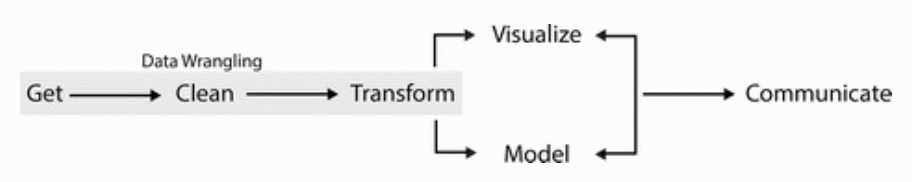

Data Wrangling with R
======================================
author: Jeho Park
date: June 10, 2021
autosize: true

QCL Workshop Participation Requirements: 
========================================================
Those of you attending this workshop as part of requirements for your research group, student employment, or fellowship position, you must attend the workshop fully, do all the hands-on exercises plus homework to be qualified. 

If you have to leave in the middle of the workshop, please leave a note on the chat for the record.

Recommendations for Engagement:  
(1) Use your camera to show your attention  
(2) Use gestures such as nodding, thumbs-up, and raising hand to signal your understanding/misunderstanding  
(3) Unmute yourself to ask questions *anytime* 

Workshop Environment Setup
====================================
### 1. Log in to RStudio Cloud
### 2. Create a new project -->  Clone the workshop files from my GitHub Repo (i.e., "New Project from Git Repo")
### 3. Open data-wrangling.Rpres
### 4. Open QCL-R-Workshop-L2-Hands-On.Rmd

    
*GitHub repo: https://github.com/CMC-QCL/R-Data-Wrangling-L2-Workshop.git

Agenda: Data Wrangling with R
====================================
- What is data wrangling?
- Built-in datasets
- Simple data examination and exploration
- Simple data visualization
- Data manipulation using dplyr package
- Data import (later in hands-on)
- Hands-On: 
  - Find information from a "birth2015" dataset; 
  - Create a barplot showing COVID-19 daily new cases in the U.S.

What is Data Wrangling?
======================================

  
Source: Wrangling Wild Horses in the Mountains of Montana (Director: Kristopher Rey-Talley) | Short Film Showcase | National Geographic Channel on Youtube (https://youtu.be/vkBtEe-lieU?t=131) | clip from 2:11 to 3:11

What is Data Wrangling?
=============================================
Data wrangling is the process of obtaining, cleaning, reshaping and transforming raw (and messy) data into a usable form of processed (and tidy) data.

  
Source: "Data Wrangling with R" by Bradley C. Boehmke | Use R! Series

CO2 Dataset from "datasets" Package
====================================
- The CO2 data frame has 84 rows and 5 columns of data from an experiment on the cold tolerance of the grass species Echinochloa crus-galli.

```r
help(CO2) # see what the dataset is about
CO2 # display all the contents of the data frame, CO2
View(CO2)
```

- The `datasets` package contains several useful toy datasets. 
- Try `data()` from the console

A Quick Look of a Dataset (data.frame)
========================================================
Here are some simple and handy functions for everyday use.

```r
head(CO2) # show the first few observations
tail(CO2, 1) # show the last observation
summary(CO2) # this is a very handy function!
str(CO2) # show the structure of the data.frame
names(CO2) # show the variable names
```

Data Visualization
========================================
- Basic plots such as histogram, box plot, and scatter plot are within a few key strokes away (type `his` in the console and wait for a sec)


```r
hist(CO2$uptake) # Use help function to check its arguments
boxplot(CO2$uptake ~ CO2$conc)
plot(x = CO2$conc, y = CO2$uptake)
```
**Note that we used '$' to access (or extract) a variable (or a column) of a dataframe. 

Data Manipulation using dplyr
===========================================


Data Manipulation using dplyr
===========================================
- `dplyr` is the most popular package for data exploration and transformation
- `dplyr` includes 
   - `filter` 
   - `select` 
   - `arrange` 
   - `mutate`
   - `summarise` 
   - `group_by`
   

Data Manipulation using dplyr
===========================================
- `dplyr` is the most popular package for data exploration and transformation
- `dplyr` includes 
   - `filter` picks variables based on their values.
   - `select` picks cases based on their names.
   - `arrange` changes the ordering of the rows.
   - `mutate` adds new variables that are functions of existing variables.
   - `summarise` reduces multiple values down to a single summary.
   - `group_by` performs any operation by group.

## Check if you have the `dplyr` package installed and loaded. If not installed, install `tidyverse` package which includes `dplyr` and other useful packages such as `ggplot2`.

Data Manipulation using dplyr::filter
========================================
- `filter` with a logical operator on a value will filter in/out those observations (rows) with the value.


```r
# Logical Operators in R
5 < 2
(5 < 2) & (3 > 2)
5 %in% c(1,2,3,4,5)
is.na(c(1,2,NA,4,5))
```

- `filter` manipulates observations (rows).


```r
filter(CO2, Treatment=='chilled')
```

Hands-On 1
=========================================
Which group of plants has a higher average uptake rate, chilled plants or nonchilled plants? 


```r
#_FILL-IN_# # your work here
```

Data Manipulation using dplyr::select
===========================================
- `select` picks cases based on their names.
- `select` manipulates variables (columns).

The following shows the first 6 observations containing only Plant and uptake variables from the CO2 data.frame:

```r
head(select(CO2, Plant, uptake))
```

Hands-On 2
===================================================
Create a new data.frame, `x`, with two variables, Plant and uptake, containing only non-chilled plant cases from CO2 dataset.


```r
#_FILL-IN_# # your work here
```

Data Manipulation - Chaining using %>%
========================================================
- You can chain dplyr functions together using a special looking operator called a pipe operator: `%>%` 
- The pipe operator feeds the resulting object into the 1st argument of the next function.
- The keyboard shortcut is Ctrl + Shift + M (Windows) or Cmd + Shift + M (Mac).

For example,

```r
CO2 %>% 
  filter(Treatment=='nonchilled') %>% 
  select(Plant, uptake) %>% 
  head()
```

Compare that with the following:

```r
head(select(filter(CO2, Treatment=='nonchilled'), Plant, uptake))
```

Hands-On 3
===================================================
Now let's try chaining (piping) to create a new data.frame, `y`, only containing nonchilled plants with Plant and uptake variables. 

Using CO2 dataset,  
(1) filter out chilled plant cases, so the data.frame only has __nonchilled__ plant cases,  
(2) select two variables, `Plant` and `uptake` from the new data.frame,  
(3) assign the new data.frame to a new variable, `y`, and   
(4) compare `x` and `y` and see if they are indeed the same.


```r
#_FILL-IN_# # your work here
```


Data Manipulation using dplyr::arrange
========================================================
- `arrange` sorts observations (rows) by a variable (column) in ascending order
- `arrange` manipulates the order of observations.

What are the three lowest CO2 uptake cases?

```r
CO2 %>% arrange(uptake) %>% head(3) # ascending order is default
```

Hands-On 4
====================================================
What are the three highest CO2 uptake cases?

```r
#_FILL-IN_# # your work here
```


Data Manipulation using dplyr::mutate
========================================================
- `mutate()` creates new variables and adds it to the end of the data.frame.
- `mutate` manipulates variables (columns).

Create a new variable `conc_L` containing concentration values divided by 1000

```r
CO2 %>% mutate(conc_L = conc / 1000)
```

Data Manipulation using dplyr::summarise and dplyr::group_by
========================================================
- `summarise` applies a summary function (e.g., mean, sum, etc.) and returns a result.
- To aggregate variables, `group_by` and `summarise` work together as follows:

Aggregate `CO2` into average values of uptake by plant type:

```r
CO2 %>% 
  group_by(Type) %>% 
  summarise(avg = mean(uptake)) 
```

Data Manipulation - Pro Tips
========================================================
- In datasets with a lot of variables, you can use select function to exclude certain variables by using the '-' operator. For example, try `select(CO2, -Plant)`
- When aggregating data, you need an aggregate function whose result is a single value such as mean, median, n (number of rows in a group), sum, etc.
- If your data have missing values AND you want to exclude them, you need to add the parameter `na.rm = TRUE`. _Caution!_ This will skip any observation having a missing value. _Caution2!_ Sometimes missing values are meaningful. So do not simply exclude them in your data manipulation stage.
- When working with data, the data manipulation process often takes more time than the analysis.

End of Session I
=====================
You've learned:
- data wrangling 
- a couple of simple ways to examine your dataset
- a couple of data visualizations
- various ways to manipulate data using dplyr's `filter`, `select`, `arrange`, `mutate`, `summarise`, and `group_by` function.

Session II
======================
For the rest of the workshop, you will be working on a couple of hands-on exercises. If you cannot finish them all in time, you are welcome to finish it after the workshop. A QCL staff can help you remotely and synchronously via Zoom or asynchronously via emails.

Hands-On Exercise 1 (Difficulty: low)

Hands-On Exercise 2 (Difficulty: medium-high)


Hands-On Exercise 1 (Difficulty: low)
========================================================
First, import "Births2015.csv" from GitHub as a data.frame `births2015` to answer the questions below:

1. What are the variables of `births2015` data.frame?
2. What is the total number of babies born in 2015?
3. Make a histogram of number of births.  
4. How many babies were born on Wednesdays? (must use the pipe operator)
5. Which `date` had the least amount of babies born?

The Births2015 CSV file is at https://raw.githubusercontent.com/jehopark/data_wrangling_with_r_beginners/master/Births2015.csv

To import a CSV data file from the Internet:

```r
library(readr) # need this for read_csv
fileurl <- "https://raw.githubusercontent.com/jehopark/data_wrangling_with_r_beginners/master/Births2015.csv"
births2015 <- read_csv(fileurl) 
```


Hands-On Exercise 2 (Difficulty: medium-high) 
========================================================
## COVID-19 Cases in the U.S.

Create a barplot showing daily changes in the new COVID-19 cases in the US.

(1) Data can be found from The NY Times: Coronavirus in the US   
Here's the [report](https://www.nytimes.com/interactive/2020/us/coronavirus-us-cases.html) and [data description](https://www.nytimes.com/article/coronavirus-county-data-us.html)  
(2) Open the GitHub repository where they store the up-to-date datasets  
(3) Find the **raw** CSV file URL for U.S.State-Level Data (us-states.csv); copy the link address.
(4) Save the link address as fileurl variable.  
(5) Import us-states.csv to your R Environment and see what are the variable names  
(6) Group by `date` and then pipe the results to `summarise` to generate a new variable `sum_cases`; what is the summary function you want to use for summarise?  
(7) Create a new variable (column) `daily_cases` by mutating the `sum_cases` variable; what kind of mutation do you need here? For calculating the difference between two consecutive days, you want to use `lag` function. Try `lag(1:10, 1)` to see what it returns.  
(8-1) Use barplot to plot the `daily_cases` variable.
(8-2) If you are familiar with ggplot2, use geom_bar.

Homework Excercise 2! (Solution skeleton)
========================================================
Create a barplot showing daily changes in the new COVID-19 cases in the US.


```r
library(readr) # need this for read_csv

fileurl <- " #_FILL-IN_# "
us_states <- read_csv(fileurl) # import CSV

data_covid <- us_states %>% 
  #_FILL-IN_# %>% # group_by
  #_FILL-IN_# %>%  # summarise
  #_FILL-IN_# # mutate and lag
barplot( #_FILL-IN_# ) # just a simple barplot with one argument 

# or use ggplot2 
require(ggplot2)
p <- data_covid %>% 
        ggplot( #_FILL-IN_# ) + 
        geom_bar(stat="identity", color="orange")
p
```
  
### Extra Hands-On: Add the seven day moving average line to the bar plot.

So What Should We Do?
===============================================
# #WearAMask
# #WashHands
# #KeepSocialDistancing
and...
# #LearnR!

End of Session II
========================================================
# Make sure you can 
* Import CSV files from a local folder as well as from a remote location
* Plot histogram and barplot
* Use pipe operator from dplyr package
* Use different functions from dplyr such as filter, select, arrange, mutate, summarise, and group_by.

To Be Eligible for a Credit
========================================================
(1) Participate in the workshop.  
(2) Follow all the hands-on activities.  
(3) Update the R Markdown (QCL-R-Workshop-L2-Hands-On-INITIAL.Rmd) containg all hands-on exercises. 
(4) Send the R Markdown file to `qcl@cmc.edu` as an attachment.
(5) Subject line: "QCL R Workshop L2 - [YOUR_NAME] - [DATE]"

[FREE!] resources for your further study
========================================================
- Swirl (http://swirlstats.com/)
- DataCamp (https://www.datacamp.com/courses/tech:r)
- R for Data Science by Hadley Wickham (http://r4ds.had.co.nz/) (Free)
- Statistics.com (https://www.statistics.com/landing-page/r-courses/)
- Data Wrangling with R by Bradley Boehmke (free eBook from the library)
- The R Book by Michael Crawley (free eBook from the library)
- `dplyr` cheat sheet (https://github.com/rstudio/cheatsheets/blob/master/data-transformation.pdf)

Thank you!
==========================================
Your feedback is valuable!

# Please fill in our online feedback survey.

